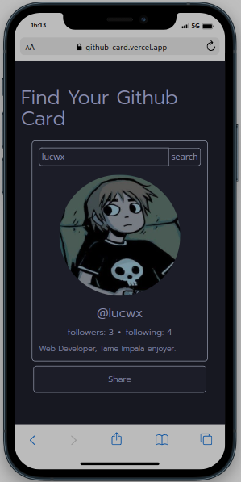

# Github-card

this project consists of fetching a username from github and the information is returned in the form of a custom Card, using events and DOM manipulation, asynchronous API queries and component creation

technologies used: HTML, CSS, Tailwind, Vue, Pinia

Images of project:

Image in mobile:
 

